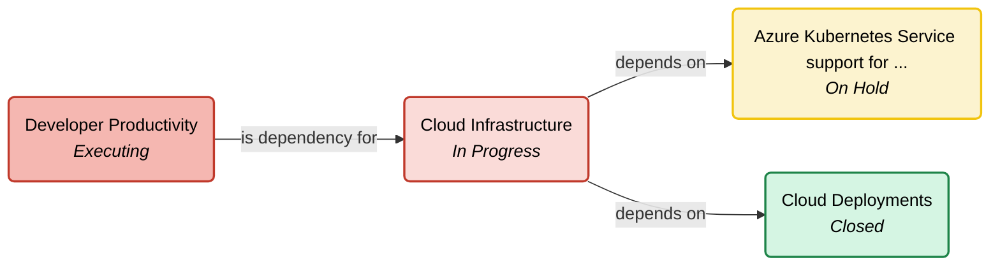

# Stakeholder & Dependency Mapping Tool

This tool provides a visual representation of program initiatives and their dependencies. It reads data from a `program_data.json` file and generates a Mermaid diagram, which can be rendered to visualize the relationships between different parts of a program.

## Tech Stack

*   **Python 3**: The core language for the script.
*   **Mermaid**: Used for generating the diagrams. The script outputs a Mermaid-compatible definition.

## Environment Setup

To set up the environment on your local machine, follow these steps:

1.  **Install Python 3**: If you don't have Python 3 installed, you can download it from the [official Python website](https://www.python.org/downloads/).

2.  **Clone the repository**:
    ```bash
    git clone https://github.com/mathewbaiju/stakeholder-mapping.git
    cd stakeholder-mapping
    ```

The script uses standard Python libraries (`json`, `os`, `argparse`), so no additional packages need to be installed with `pip`.

## Running with an AI Agent (Cursor)

You can also run this tool using an AI agent like Cursor. The agent can execute the script and generate the diagram for you directly in the chat.

1.  **Open the project** in your AI-powered editor.
2.  **Use a prompt** to ask the agent to run the script. For example:
    > "Run the code to generate the dependency diagram."

The agent will execute the `stakeholder_map.py` script, and if you ask it to, it can render the Mermaid output as a visual diagram in the chat interface.

## How to Run

To generate the dependency map, run the script from your terminal:

```bash
python3 stakeholder_map.py
```

### Filtering

To focus on a single dependency, you can generate a diagram for one ID alone. Use the `--filter_id` command-line argument, followed by the specific ID you want to visualize.

For example, to see only the diagram for `PBE-2346`, run the following command:
```bash
python3 stakeholder_map.py --filter_id PBE-2346
```
**Note**: When using this filter, the diagram will show the specified dependency from the `depends_on` list, and it will *always* include all items from the `is_dependency_for` list.

## Example Output

Here is an example of the kind of diagram this tool can generate. The colors of the boxes indicate the status of each item.


